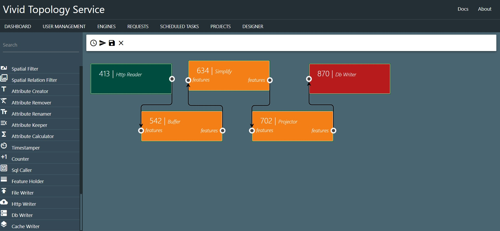

# Vivid Topology Service (VTS)

   

The Vivid Topology Service is an application that allows for ETL and transformation of spatial data from a number of source formats. For instance, you can open a shapefile from a local path or on the web, buffer all features contained, add a calculated Area attribute, and write it to a KML file. Or perhaps something more 
useful! Requests can be ad hoc or scheduled to run at repeating intervals.

The application dashboard:

## Documentation

In progress. See the [Documentation](documentation.md) guides.

## What is it?

VTS is a web application, a small rest service, and 1+ "engine" services, backed by a MongoDB instance. Requests, scheduled tasks, and projects can be created via the main web application. These are then pulled for processing by the Engine service (you can run multiple engines) which does the processing.

### Engines?

Engines are where VTS does the work within a request. You can run multiple engines, and specify if an engine can handle scheduled tasks, ad hoc requests (or both). You can edit the external route for an engine (it needs to be valid or the engine won't function), and view messages and metadata log events.

From the Engines UI, you can also temporarily halt an engine or flush the processing queue to clear up memory.

## What can VTS do?

In the current prototype implementation, we can Read GeoJSON, KML, KMZ, GML, Shapefile, and FGDB from a path or via the web, and write to the same formats (minus FGDB, which is in progress). Other file formats are planned. Database formats are coming soon (Oracle, postgis, mongodb, couchdb and others).

Data itself can be transformed by various processors, such as buffers, convex/concave hulls, clipping, dissolving, filters, calculations, etc.

To create the requests, the web application includes a "request designer" where you can drop processors and wire them together, but you can always create requests in JSON and submit them manually.

While your process is running, you can view the request status and see various messages from the engine (errors or just information).

Additionally, either during or after processing, you can view the process results in a map.

VTS has very simple user management. A Default admin user can be created. From there, administrator users can create other admin or public access users. Public access users can create projects and requests, but cannot create scheduled tasks, view the engine details, or view other users requests.

## Planned processors

Currently there are 51 processors (including readers and writers). Documentation for each one is in progress!

## Technologies Used

- [NodeJS](https://nodejs.org/en/)
- [Express](https://expressjs.com/)
- [Vue](https://vuejs.org/)
- [Turf](https://turfjs.org/)
- [JSTS](http://bjornharrtell.github.io/jsts/")
- [ESRI JS API](https://developers.arcgis.com/javascript/)
- [Materialize CSS](https://materializecss.com/)
- [JSPlumb](http://jsplumb.github.io/jsplumb/home.html)
- [MongoDB](https://www.mongodb.com/)
- [Mongoose](https://mongoosejs.com/)
- [Docker](https://www.docker.com/)

## Is it Production Ready?

No! This version is a prototype. There are bugs, some features are not implemented or are only partially working.

## Additional planned features

Too many to list if this goes beyond the prototype stage.

## How do I run it?

See the [Install Guide](install.md)

