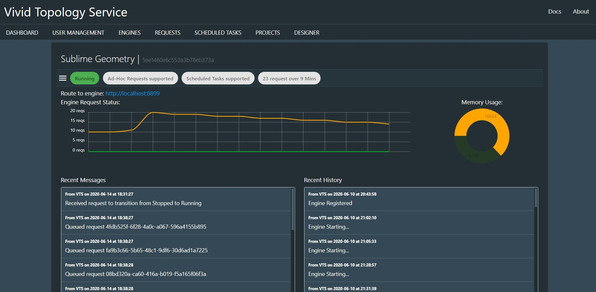
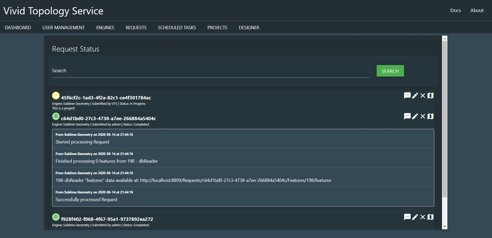

# VTS User Guide

## Logging In

When you first navigate to the VTS UI, you'll be sent to the login screen.

Logging in is easy. Enter your username  and password, and you'll be logged in and redirected to the appropriate dashboard for your user role (admin or public).

If you've just installed VTS, you can log in with `admin` and `password`. Its recommended to update the admin password as soon as possible, or create a new admin user and delete the default.

## Administration

If you have administration priviliges, you'll be sent to the admin dashboard after logging in.

### Admin Dashboard

The dashboard lets you see, at a quick glance, all of the running processes for any running engine, as well as the status of requests for the last 24 hours. You can also see a listing of upcoming scheduled tasks.

#### Engines

This tab will show you a line graph of the number of running requests. Each engine will have a different coloured line. From this dashboard panel you can click the `Manage` option to view or update engine details. The `Start All` and `Stop All` options will trigger the startup or shutdown process for all engines. This tab is only available to admin users.

#### Requests

This tab displays the results of the last 24 hours of stored processed requests. The pie chart details the current status of requests. From this dashboard panel you can click `Manage` to view and manage all available requests, or `Create` to go to the Request Designer and create a new request. This tab is also available to public users.

#### Projects

Projects are saved requests that have not yet been submitted. This allows you to work on a request and run tests before officially executing it or scheduling it. This tab has no dashboard display currently. You only have `Manage` options to view and manage all available projects. This tab is also available to public users.

#### Scheduled Tasks

This tab displays the listing of all scheduled tasks, in order of their next execution time. You have the option to click `Manage` to view or manage the scheduled tasks, or `Create` to go to the Request Designer and create a new Scheduled Task. This tab is only available to admin users.

### Engine Management

Admin users can manage Engines in the Engine Management screen. The Engine management screen will contain a listing of all available engines (registred and unregistered).

Each card in the Management screen contains the engines Name and key ID (database key) at the top, and a series of chips below indicating the running status, what sort of requests are accepted, and the uptime,

The chip bar below the title can be clicked to expand the engine details

Once expanded, more details are presented. You can view a bar graph of the number of Queued and Running requests, and a memory graph showing how much memory is available to the engine. This is useful for determining if you Engine deployment is unhealthy and needs a flush or a restart.

At the bottom of the card are 4 buttons.

These are (in order from left to right) `Startup/Shutdown Engine`, `Flush Engine Queue`, `Edit Engine`, and `Delete Engine`.

#### Startup / Shutdown

This will suspend or start engine activity. While an engine is in shutdown mode, it will not queue requests.

#### Flush Queues

When this button is pressed, the engine will immediately flush all Queued requests. Useful if the engine is shutting down, or memory is an issue and you need to requeue running tasks.

#### Delete Engine

This will delete the registration for the engine in MongoDB. Note that this will also shut down the engine that was deleted (assuming it was running). When restarted, the engine will recreate the entry, and may require re-registration. This option can be useful to force-kill an engine.

#### Edit

You can edit a number of Engine options. This is also where you register engines that have been started but are not currently linked to a VTS Server.

Because the engines Name/ID is "owned" by the engine startup, you cannot modify it here. You can edit an engines accessible route, and the request types that are accepted.

#### Route

When you first start an engine, it will create a record in the MongoDB that the VTS Master server will load. If you did not supply a route at Engine startup, the engine will be flagged as `Unregistered`. This means that the engine cannot be used. To Register, just supply a route that VTS can call the engine on. The route does not need to publically accessible, just accesible to VTS itself. You can update and test the route at any time.

#### Request flags

You can set your engine to accept ad-hoc and/or scheduled tasks. This is handy if you want an engine to be specific to handing one type of request, for instance as a scheduled task runner that you don't want resources being consumed by random requests.

### Request Management

The requests management screens allow you to view the status of all available requests. You can view any message logs, edit, delete or view the results of the request on a map.

At the top of the screen is a search bar. The text search allows you to enter the name, engine, submitter or processor name and filter the requests.

Each row of the table will display the request Name, the status (`Submitted`, `Queued`, `In Progress`, `Completed`, `Failed`) and available options.

The request options are (from left to right) `Messages`, `Edit`, `Delete`, `View on Map`.

#### Messages

The Message queue will show the results of the processing as it runs, and will contain errors or links to the results of each processor.

#### Edit Request

The edit view will open the request in the Request Designer where you can make edits and submit as a new request.

#### Delete Request

It deletes the request. This will clear any cached data as well.

#### View on Map

This will open the request in the map viewer, displaying the current results of the request.

### Project Management

The projects management tab functions exactly the same as the Requests management tab, however it contains fewer options, only allowing you to edit or delete the project.

### User Management

Administrator users can manage all users of VTS. This means they can create new users, delete users, or update existing users. Public users cannot register for VTS without administrator action. All users of VTS will need an admiistrator to manually create a user entry for them.

The only availale options are `Edit` and `Delete`.

#### Add/Edit User

When editing or creating a user, you can supply a user name, email address, password and role. Public users do not see the role option when editing their own user record.

You cannot see a users password, as they are hashed in the database. Any entry into this option will change the users password.

#### Delete User

This will permenently delete the user from VTS. To log in again, the user will need to be recreated.

## Public User

Public users have the same experience as Admin users, however their dashboard is limited. A Public user has no access to Engine or Scheduled Task management, and they can only see their own created requests in the Projects and Requests management screens. The Designer is fully functional, but they will not be able to schedule tasks.

Users have access to User Management, but only to edit their own user record. Public users cannot change their role.

## The Request Designer

The request designer is a flowchart tool that allows you to drag and drop processors from the left-hand menu, and link them together into workflows.

Processors can be found by scrolling the list box, or entering a search term to filter options. To add a processor, click once on the option in the list box, or drag and drop it wherever on your designer screen you like.

Once your processors are dropped onto the workflow designer, they can be linked by dragging from an output node (the dots on the right) and connecting to an input node (the dots on the left). Readers have no input nodes, and writers have no output nodes. They are colour coded for visual convinience, with Readers in Green, processors in Orange, and writers in Red.

Some processors, readers and writers have options that can be, or must be, set for the processor to function as expected. To view these options, double-click on the processor you wish to modify to open the processor editing screen.

Each processor will have different options. These are explained in greater detail in the [Processor Documentation](processors.md).

At the bottom of the edit screen are three options, (left to right) `Save`, `Close`, `Delete`

To save any changes made, click anywhere on the designer workflow panel, or click the green save icon in the editor.

The red X icon will close the editor without saving changes.

You can delete a processor from your workflow by clicking the red trash-can icon in the bottom of the editor panel.

### Completing your request

Once you've finished creating your workflow, you can save it or run it. The designer has a button bar at the top with the following options:

These options are (from left to right) `Save as Scheduled Task`, `Execute Request`, `Save as Project`, `Clear Designer`.

Public users will not have the option to save as a scheduled task.

#### Save Scheduled Task

This option will save the request as a scheduled task. Scheduled tasks are given a timeframe for execution, and will run within that timeframe repeatedly.

You can set a time-unit of `Minutes`, `Hours`, or `Days`. Units must be whole numbers.

A name and a description can be supplied for your task for easy identification and informational purposes. Note that if your name includes spaces, these will be replaced with dashes. Note that scheduled task names must be unique system-wide.

#### Execute Request

This will immediately execute the workflow as an ad-hoc request. You can navigate to the Request Management winow to view progress. Ad-Hoc request will be given a generated UUID as an identifier.

#### Save as Project

This option will save the request as a Project. It will not be executed, and can be opened again and edited in the future. Projects can be executed as ad-hoc requests at any time.

Projects can have a unique name as an identifier, and a description. If you include spaces, they will be replaced by dashes. Note that Project names must be unique system-wide.

#### Clear Designer

This will clear the workflow, removing all processors and options that were placed there.